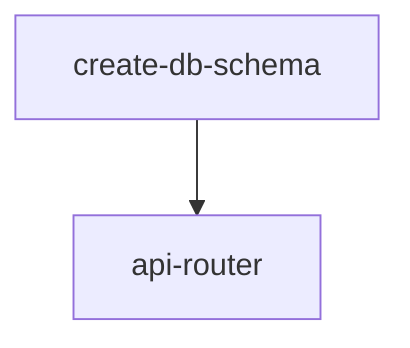

# API Router Generator

Create ORPC routers with CRUD handlers. AI creates files following this pattern.

## File Location

Create at: `packages/api/src/routers/{entity}.ts`

## Dependencies



**Prerequisite:** Run **create-db-schema** skill first to create the database schema. The schema file in `packages/db/src/schema/{entity}.ts` MUST already export `insert{Entity}Schema` and `update{Entity}Schema` (generated by drizzle-zod) before creating the router.

## Pattern

```typescript
// ⚠️ CRITICAL: Must use "zod/v4" — NEVER "zod" (v3-compat layer crashes with drizzle-zod schemas)
import { z } from "zod/v4";
import { createDb } from "@template/db";
import { protectedProcedure } from "../index";
import { eq, desc } from "drizzle-orm";
// ✅ Import table AND schemas from db package — schemas are generated by drizzle-zod in schema file
import { {entity}, insert{Entity}Schema, update{Entity}Schema, {entity}RouterOutputSchema } from "@template/db/schema";

export const {entity}Router = {
  // List all {entity}
  // ⚠️ .output() uses routerOutputSchema (NOT selectSchema) — selectSchema is for the collection.
  // routerOutputSchema must match what the DATABASE RETURNS (e.g., Date for timestamps, not string).
  selectAll: protectedProcedure
    .output(z.array({entity}RouterOutputSchema))
    .handler(async ({ context }) => {
      const db = createDb();
      return db.select().from({entity})
        .orderBy(desc({entity}.createdAt));
    }),

  // Get single {entity} by ID
  selectById: protectedProcedure
    .input(z.object({ id: z.string() }))
    .output({entity}RouterOutputSchema.nullable())
    .handler(async ({ input }) => {
      const db = createDb();
      const result = await db.select().from({entity})
        .where(eq({entity}.id, input.id))
        .limit(1);
      return result[0] ?? null;
    }),

  // Create {entity} (bulk insert)
  insertMany: protectedProcedure
    .input(z.object({ {entity}: z.array(insert{Entity}Schema) }))
    .handler(async ({ input }) => {
      const db = createDb();
      const results = await Promise.allSettled(
        input.{entity}.map(async (itemData) => {
          const [item] = await db.insert({entity})
            .values(itemData)
            .returning();
          return item;
        })
      );

      const created = [];
      const failed = [];

      for (const result of results) {
        if (result.status === "fulfilled") {
          created.push(result.value);
        } else {
          failed.push({
            error: result.reason instanceof Error
              ? result.reason.message
              : "Unknown error",
          });
        }
      }

      return { created, failed };
    }),

  // Update {entity} (bulk update)
  updateMany: protectedProcedure
    .input(z.object({ {entity}: z.array(update{Entity}Schema) }))
    .handler(async ({ input }) => {
      const db = createDb();
      const results = await Promise.allSettled(
        input.{entity}.map(async (itemData) => {
          const { id, ...changes } = itemData;
          const [item] = await db.update({entity})
            .set({ ...changes, updatedAt: new Date() })
            .where(eq({entity}.id, id))
            .returning();
          return item;
        })
      );

      const updated = [];
      const failed = [];

      for (const result of results) {
        if (result.status === "fulfilled") {
          updated.push(result.value);
        } else {
          failed.push({
            error: result.reason instanceof Error
              ? result.reason.message
              : "Unknown error",
          });
        }
      }

      return { updated, failed };
    }),

  // Delete {entity} (bulk delete)
  deleteMany: protectedProcedure
    .input(z.object({ ids: z.array(z.string()) }))
    .handler(async ({ input }) => {
      const db = createDb();
      const results = await Promise.allSettled(
        input.ids.map(async (id) => {
          const deleted = await db.delete({entity})
            .where(eq({entity}.id, id))
            .returning({ id: {entity}.id });
          return deleted[0]?.id;
        })
      );

      const deleted = [];
      const failed = [];

      for (let i = 0; i < results.length; i++) {
        const result = results[i];
        const id = input.ids[i];
        if (result?.status === "fulfilled") {
          deleted.push(result.value);
        } else {
          const reason = result?.status === "rejected" ? result.reason : undefined;
          failed.push({
            id,
            error: reason instanceof Error ? reason.message : "Unknown error",
          });
        }
      }

      return { deleted, failed };
    }),
};

export type {Entity}Router = typeof {entity}Router;
```

## Rules

- **Use `.output()` with `{entity}RouterOutputSchema`** on `selectAll` and `selectById` — this schema must match the raw database return types (Date for timestamps, not string)
- **Follow the template exactly** — do not add per-user filtering, extra validation, or patterns not shown above
- **NEVER use `any` type** — use proper types, generics, or `unknown` with type narrowing
- **NEVER suppress typecheck errors** with `// @ts-ignore`, `// @ts-expect-error`, `// @ts-nocheck`, or `// eslint-disable` — fix the type error instead

## CRUD Operations

| Operation  | Procedure | Input                                         |
| ---------- | --------- | --------------------------------------------- |
| selectAll  | handler   | None                                          |
| selectById | handler   | `{ id: z.string() }`                          |
| insertMany | handler   | `{ {entity}: z.array(insert{Entity}Schema) }` |
| updateMany | handler   | `{ {entity}: z.array(update{Entity}Schema) }` |
| deleteMany | handler   | `{ ids: z.array(z.string()) }`                |

## Register Router

After creating the file, register in `packages/api/src/routers/index.ts`:

```typescript
import { {entity}Router } from "./{entity}";

export const appRouter = {
  {entity}: {entity}Router,
  // ...
};
```

## Related Skills

- **create-db-schema** - Creates the table schema (run first)
- **query-collections** - Creates Collection, Dialog, and Form with inline Form Schema
- **customize-table** - Creates column definitions
- **handle-views** - Creates List Route and Detail Route
