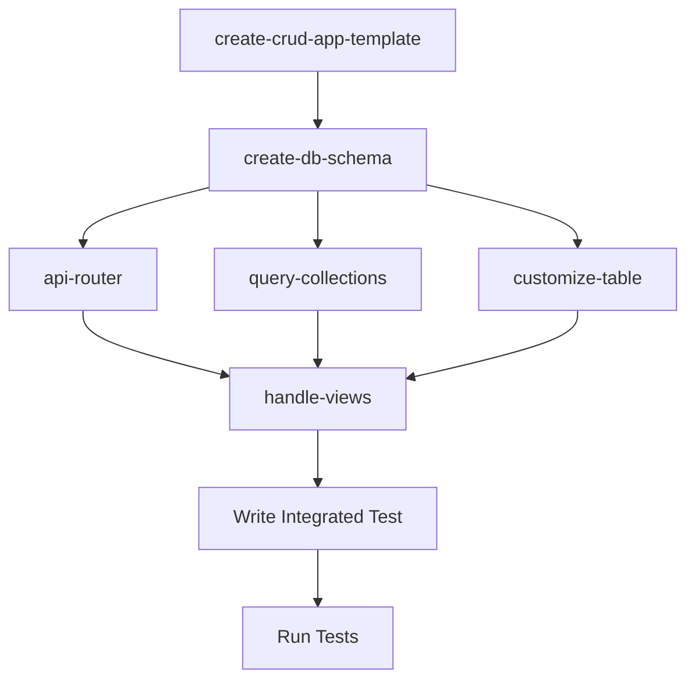

# Create CRUD App Template

> **Web only.** This skill generates files into `apps/web/`. Do NOT use if `apps/web/` does not exist.

Orchestrates sub-skills to generate a complete CRUD feature. All schemas are defined in `packages/db/src/schema/` using drizzle-zod and imported into routers, collections, and forms. See `packages/db/CLAUDE.md` for the schema architecture.

## Execution Order



| Skill                 | Purpose                                            |
| --------------------- | -------------------------------------------------- |
| **create-db-schema**  | Table + all drizzle-zod schemas                    |
| **api-router**        | ORPC router (imports schemas from db)              |
| **query-collections** | Collection, Dialog, Form (imports schemas from db) |
| **customize-table**   | DataTable column definitions                       |
| **handle-views**      | List Route and Detail Route                        |

## Files Generated (10 per entity)

| Layer        | File                                                                       |
| ------------ | -------------------------------------------------------------------------- |
| Schema       | `packages/db/src/schema/{entity}.ts`                                       |
| Router       | `packages/api/src/routers/{entity}.ts`                                     |
| Collection   | `apps/web/src/query-collections/custom/{entity}.ts`                        |
| Dialog       | `apps/web/src/components/ui/data-table/custom/{entity}/{Entity}Dialog.tsx` |
| Form         | `apps/web/src/components/ui/data-table/custom/{entity}/{Entity}Form.tsx`   |
| Columns      | `apps/web/src/components/ui/data-table/custom/{entity}/{Entity}Column.tsx` |
| Index        | `apps/web/src/components/ui/data-table/custom/{entity}/index.ts`           |
| List Route   | `apps/web/src/routes/_auth.{entity}.tsx`                                   |
| Detail Route | `apps/web/src/routes/_auth.{entity}_.$id.tsx`                              |
| **Test**     | `packages/test/src/{entity}.test.tsx`                                      |

## Post-Creation Steps

1. **Register router** in `packages/api/src/routers/index.ts`
2. **Add route to sidebar** in `apps/web/src/components/app-sidebar.tsx`
3. **Typecheck only your files** (NEVER project-wide):
   ```bash
   bunx oxlint --type-check --type-aware --quiet packages/db/src/schema/{entity}.ts packages/api/src/routers/{entity}.ts apps/web/src/routes/_auth.{entity}.tsx apps/web/src/routes/_auth.{entity}_.\$id.tsx apps/web/src/components/ui/data-table/custom/{entity}/*.tsx apps/web/src/query-collections/custom/{entity}.ts
   ```
4. **Read the test guide BEFORE writing any test code:**
   You MUST use the Read tool to read `packages/test/CLAUDE.md` in full before creating `packages/test/src/{entity}.test.tsx`. Do NOT write the test from memory or general knowledge — the test infrastructure has project-specific requirements (mock ordering, spy targets, HappyDOM constraints) that cannot be guessed.

5. **Typecheck your files, then run tests**:
   ```bash
   bunx oxlint --type-check --type-aware --quiet packages/db/src/schema/{entity}.ts packages/api/src/routers/{entity}.ts apps/web/src/routes/_auth.{entity}.tsx apps/web/src/routes/_auth.{entity}_.\$id.tsx apps/web/src/components/ui/data-table/custom/{entity}/*.tsx apps/web/src/query-collections/custom/{entity}.ts
   cd packages/test && bun test src/{entity}.test.tsx
   ```

## Completion Verification

**Before declaring complete, run:**

```bash
grep -c "test(\"create\|test(\"update\|test(\"delete" packages/test/src/{entity}.test.tsx
```

**Output MUST be 3.** If less than 3, go back and add the missing tests.

- [ ] Test file exists at `packages/test/src/{entity}.test.tsx`
- [ ] All 3 CRUD tests exist (create, update, delete)
- [ ] All 3 tests pass

## ⚠️ Critical Rules

- **NEVER use `any` type** in generated code — use proper types, generics, or `unknown` with type narrowing
- **NEVER suppress typecheck errors** with `// @ts-ignore`, `// @ts-expect-error`, `// @ts-nocheck`, or `// eslint-disable` — fix the type error instead
- **Use `text()` for IDs** — client-generated string IDs are required for TanStack DB optimistic updates
- **`form.handleSubmit` MUST pass `onInvalid` callback** — `form.handleSubmit(onValid, (errors) => console.error("Form validation errors:", errors))`. Without this, zodResolver rejections are SILENT — `onSubmit` never fires, no error is shown, and tests time out with no clue why

## Error Handling

| Source                 | Handling                        | Example                          |
| ---------------------- | ------------------------------- | -------------------------------- |
| Form (React Hook Form) | Inline via `FormMessage`        | `"name is required"` under field |
| ORPC/Collection        | Toast notification via `sonner` | `"API: Validation failed"`       |
