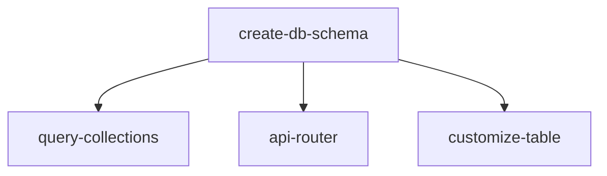

# Schema Generator

Create database table schemas with Drizzle ORM and drizzle-zod derived schemas.

## File Location

Create at: `packages/db/src/schema/{entity}.ts`

## Dependencies

**ALWAYS run create-db-schema FIRST** — it creates the table and all derived schemas that other skills import.



## Pattern

```typescript
import { pgTable, text, timestamp } from "drizzle-orm/pg-core";
import { createInsertSchema, createSelectSchema } from "drizzle-zod";
import { z } from "zod/v4"; // ⚠️ ALWAYS zod/v4, NEVER "zod"

// 1. TABLE DEFINITION (plural name)
export const {entity} = pgTable("{entity}", {
  id: text("id").primaryKey(),
  name: text("name").notNull(),
  description: text("description"),        // nullable column
  status: text("status").default("active"),
  userId: text("user_id"),
  createdAt: timestamp("created_at").defaultNow().notNull(),
  updatedAt: timestamp("updated_at").defaultNow().notNull().$onUpdate(() => new Date()),
});

// 2. INSERT SCHEMA — use CALLBACK overrides for nullable columns
export const insert{Entity}Schema = createInsertSchema({entity}, {
  name: (schema) => schema.min(1),
  description: (schema) => schema.optional(), // nullable → optional
});

// 3. SELECT SCHEMA — override nullable columns here too
export const select{Entity}Schema = createSelectSchema({entity}, {
  description: (schema) => schema.optional(),
});

// 4. UPDATE SCHEMA
export const update{Entity}Schema = select{Entity}Schema
  .partial()
  .required({ id: true });

// 5. FORM SCHEMA (excludes system fields)
export const {entity}FormSchema = insert{Entity}Schema.omit({
  id: true,
  createdAt: true,
  updatedAt: true,
});

// 6. EDIT FORM SCHEMA — for edit mode (all user fields optional)
// ⚠️ MUST NOT include `id` — the Dialog adds the id after form submission.
// Including `id` causes silent form validation failure (no id input rendered → form never submits).
export const {entity}EditFormSchema = {entity}FormSchema.partial();

// 7. ROUTER OUTPUT SCHEMA — for .output() validation on selectAll/selectById
// ⚠️ Think exhaustively about what the DATABASE RETURNS:
//   - timestamp columns → Date objects (NOT strings)
//   - nullable text columns → string | null (use .nullable().optional())
//   - boolean with default → boolean (not nullable)
// This schema is SEPARATE from selectSchema because selectSchema is used by the collection
// (which validates data from queryFn) while routerOutputSchema validates the raw DB result.
export const {entity}RouterOutputSchema = z.object({
  id: z.string(),
  name: z.string(),
  // For each nullable text column: z.string().nullable().optional()
  // For each notNull text column: z.string()
  userId: z.string().nullable().optional(),
  createdAt: z.date(),   // ⚠️ timestamp columns return Date objects from DB
  updatedAt: z.date(),   // ⚠️ NOT z.string() — that causes "Output validation failed"
});
```

## Required Fields

All entities MUST include:

```typescript
id: text("id").primaryKey(),        // Client-generated UUID
createdAt: timestamp("created_at").defaultNow().notNull(),
updatedAt: timestamp("updated_at").defaultNow().notNull().$onUpdate(() => new Date()),
```

## Column Types Quick Reference

```typescript
import { pgTable, text, varchar, integer, boolean, timestamp, jsonb, decimal, real, pgEnum } from "drizzle-orm/pg-core";

id: text("id").primaryKey(),                          // ALWAYS text — client-generated UUID
name: text("name").notNull(),                         // required string
description: text("description"),                     // nullable string
email: varchar("email", { length: 255 }).unique(),    // length-constrained + unique
age: integer("age"),                                  // nullable integer
price: decimal("price", { precision: 10, scale: 2 }), // exact decimal
score: real("score"),                                 // floating point
active: boolean("active").default(true),              // boolean with default
metadata: jsonb("metadata").$type<{ key: string }>(), // typed JSON (see ADVANCED.md)
createdAt: timestamp("created_at").defaultNow().notNull(),
updatedAt: timestamp("updated_at").defaultNow().notNull().$onUpdate(() => new Date()),
```

**NEVER use `serial()` or `bigint` for primary keys** — only `text("id").primaryKey()` supports client-generated IDs for optimistic updates.

## Migration Workflow

Run after creating or modifying ANY schema file:

```bash
cd packages/db && bun drizzle-kit generate   # generates migration SQL from schema changes
cd packages/db && bun drizzle-kit migrate    # applies migration to database
```

**NEVER hand-write, modify, or delete migration files.** The `packages/db/drizzle/` folder is managed entirely by these commands. Never manually create, edit, or delete SQL, snapshot, or journal files — doing so will cause unexpected migration conflicts.

## Export Schema

After creating the file, export in `packages/db/src/schema/index.ts`:

```typescript
export * from "./{entity}";
```

## ⚠️ Type Safety — Zero Tolerance

- **NEVER use `any` type** in generated code — use proper types, generics, or `unknown` with type narrowing
- **NEVER suppress typecheck errors** with `// @ts-ignore`, `// @ts-expect-error`, `// @ts-nocheck`, or `// eslint-disable` — fix the type error instead

## Reference Files

For advanced patterns beyond the core 7-schema template:

- **[RELATIONS.md](RELATIONS.md)** — foreign keys (`.references()`), type-safe `relations()`, many-to-many junction tables
- **[ADVANCED.md](ADVANCED.md)** — enums (`pgEnum`), JSONB with type safety, soft deletes, indexes, schema modifications

## Related Skills

- **api-router** — imports insert/update schemas from this file
- **query-collections** — imports form/select schemas from this file
- **customize-table** — creates column definitions
- **handle-views** — creates List and Detail routes
