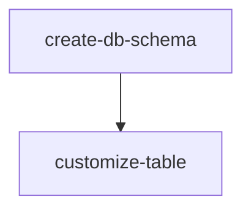

# Table Customization

> **Web only.** This skill generates files into `apps/web/`. Do NOT use if `apps/web/` does not exist.

Create and customize DataTable columns. This skill generates the `{Entity}Column.tsx` file.

## Files to Create

| File    | Location                                                                   |
| ------- | -------------------------------------------------------------------------- |
| Columns | `apps/web/src/components/ui/data-table/custom/{entity}/{Entity}Column.tsx` |
| Index   | `apps/web/src/components/ui/data-table/custom/{entity}/index.ts`           |

## Dependencies



**Prerequisite:** Run **create-db-schema** skill first to create the database schema.

## Related Skills

- **create-db-schema** - Creates the table schema (run first)
- **query-collections** - Creates Collection, Dialog, and Form with inline Form Schema
- **api-router** - Creates router with inline Insert/Update schemas
- **handle-views** - Creates List Route and Detail Route

## Base Columns Pattern

```typescript
import { createColumnHelper } from "@tanstack/react-table";
import { Badge } from "@/components/ui/badge";
import { Button } from "@/components/ui/button";
import { Edit, Trash2 } from "lucide-react";
import { useNavigate } from "react-router";

const columnHelper = createColumnHelper<any>();

export const {Entity}Column = [
  columnHelper.accessor("name", {
    header: "Name",
    cell: (info) => info.getValue(),
  }),
  columnHelper.accessor("status", {
    header: "Status",
    cell: (info) => (
      <Badge variant={info.getValue() === "active" ? "default" : "secondary"}>
        {info.getValue()}
      </Badge>
    ),
  }),
  columnHelper.accessor("createdAt", {
    header: "Created",
    cell: (info) => new Date(info.getValue()).toLocaleDateString(),
  }),
  // ⚠️ CRITICAL: Pass row.original (full object), NOT row.original.id
  // The list route's handleEdit/handleDeleteClick expect the full item object.
  // ⚠️ CRITICAL: Do NOT use confirm() — use table.options.meta?.onDelete which opens an AlertDialog.
  columnHelper.display({
    id: "actions",
    header: "Actions",
    cell: ({ row, table }) => {
      const onEdit = table.options.meta?.onUpdate as ((item: any) => void) | undefined;
      const onDelete = table.options.meta?.onDelete as ((item: any) => void) | undefined;
      return (
        <div className="flex gap-2">
          <Button variant="ghost" size="icon" onClick={() => onEdit?.(row.original)} aria-label="Edit">
            <Edit className="h-4 w-4" />
          </Button>
          <Button variant="ghost" size="icon" onClick={() => onDelete?.(row.original)} aria-label="Delete">
            <Trash2 className="h-4 w-4 text-destructive" />
          </Button>
        </div>
      );
    },
  }),
];
```

## Index Export Pattern

Create at: `apps/web/src/components/ui/data-table/custom/{entity}/index.ts`

```typescript
export { {Entity}Column } from "./{Entity}Column";
```

## Column Customization Examples

### Adding a New Column

```typescript
export const {Entity}Column = [
  // ... existing columns
  {
    accessorKey: "priority",
    header: "Priority",
    cell: ({ row }) => {
      const priority = row.getValue("priority") as string;
      return (
        <Badge variant={priority === "high" ? "destructive" : "secondary"}>
          {priority}
        </Badge>
      );
    },
  },
];
```

### Date Column with Formatting

```typescript
{
  accessorKey: "createdAt",
  header: "Created",
  cell: ({ row }) => {
    const date = new Date(row.getValue("createdAt"));
    return (
      <div className="text-sm">
        <div>{date.toLocaleDateString()}</div>
        <div className="text-muted-foreground text-xs">{date.toLocaleTimeString()}</div>
      </div>
    );
  },
}
```

### Status Badge with Variants

```typescript
{
  accessorKey: "status",
  header: "Status",
  cell: ({ row }) => {
    const status = row.getValue("status") as string;
    const variants: Record<string, string> = {
      active: "bg-green-100 text-green-800",
      pending: "bg-yellow-100 text-yellow-800",
      inactive: "bg-gray-100 text-gray-800",
    };
    return (
      <span className={`inline-flex items-center rounded-full px-2.5 py-0.5 text-xs font-medium ${
        variants[status] || variants.inactive
      }`}>
        {status}
      </span>
    );
  },
}
```

### Conditional Cell Rendering

```typescript
{
  accessorKey: "dueDate",
  header: "Due Date",
  cell: ({ row }) => {
    const dueDate = new Date(row.getValue("dueDate"));
    const now = new Date();
    const isOverdue = dueDate < now;
    return (
      <div className={isOverdue ? "text-red-600 font-semibold" : ""}>
        {dueDate.toLocaleDateString()}
        {isOverdue && " (Overdue)"}
      </div>
    );
  },
}
```

### Number/Price Formatting

```typescript
{
  accessorKey: "price",
  header: "Price",
  cell: ({ row }) => {
    const price = row.getValue("price") as number;
    return new Intl.NumberFormat("en-US", {
      style: "currency",
      currency: "USD",
    }).format(price);
  },
}
```

### Boolean/Toggle Column

```typescript
{
  accessorKey: "completed",
  header: "Completed",
  cell: ({ row }) => {
    const completed = row.getValue("completed") as boolean;
    return (
      <Badge variant={completed ? "default" : "secondary"}>
        {completed ? "Yes" : "No"}
      </Badge>
    );
  },
}
```

### Email Column

```typescript
{
  accessorKey: "email",
  header: "Email",
  cell: ({ row }) => {
    const email = row.getValue("email") as string;
    return (
      <a href={`mailto:${email}`} className="text-blue-600 hover:underline">
        {email}
      </a>
    );
  },
}
```

### URL/Link Column

```typescript
{
  accessorKey: "website",
  header: "Website",
  cell: ({ row }) => {
    const url = row.getValue("website") as string;
    return (
      <a href={url} target="_blank" rel="noopener noreferrer" className="text-blue-600 hover:underline">
        {url}
      </a>
    );
  },
}
```

### Custom Avatar/User Column

```typescript
{
  accessorKey: "avatar",
  header: "Avatar",
  cell: ({ row }) => {
    const avatar = row.getValue("avatar") as string;
    return avatar ? (
      
    ) : (
      <div className="w-8 h-8 rounded-full bg-gray-200 flex items-center justify-center">
        {row.original.name?.charAt(0).toUpperCase()}
      </div>
    );
  },
}
```

### Actions Column

See the actions column in the Base Columns Pattern above. Key rules:

- Always pass `row.original` (full object), NOT `row.original.id`
- Use `table.options.meta?.onDelete` (opens AlertDialog) — NEVER `confirm()`
- Add `aria-label="Edit"` / `aria-label="Delete"` for test accessibility

## ⚠️ Type Safety — Zero Tolerance

- **NEVER use `any` type** in generated code — use proper types, generics, or `unknown` with type narrowing
- **NEVER suppress typecheck errors** with `// @ts-ignore`, `// @ts-expect-error`, `// @ts-nocheck`, or `// eslint-disable` — fix the type error instead

## Post-Creation

1. Import columns in the list route (use **handle-views** skill)
2. Run `bunx oxlint --type-check --type-aware --quiet <your-column-file>` to verify (only your files, not project-wide)
