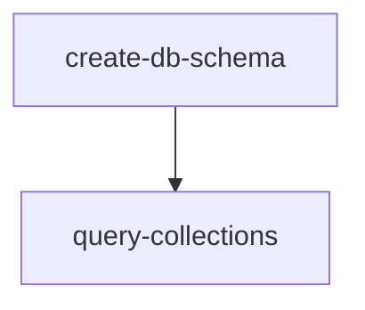

# Query Collections Generator

> **Web only.** This skill generates files into `apps/web/`. Do NOT use if `apps/web/` does not exist.

Create frontend query collections with form schema imported from `@template/db/schema`, Dialog, Form components, and toast error handling.

## Files to Create

| File       | Location                                                                   |
| ---------- | -------------------------------------------------------------------------- |
| Collection | `apps/web/src/query-collections/custom/{entity}.ts`                        |
| Dialog     | `apps/web/src/components/ui/data-table/custom/{entity}/{Entity}Dialog.tsx` |
| Form       | `apps/web/src/components/ui/data-table/custom/{entity}/{Entity}Form.tsx`   |
| Index      | `apps/web/src/components/ui/data-table/custom/{entity}/index.ts`           |

## Dependencies



**Prerequisite:** Run **create-db-schema** skill first to create the database schema.

## Error Sources

Errors come from 2 layers with different handling:

| Source          | Handling                 | Example                          |
| --------------- | ------------------------ | -------------------------------- |
| Form (RHF)      | Inline via `FormMessage` | `"name is required"` under field |
| ORPC/Collection | Toast notification       | `"API: Validation failed"`       |

## Collection Pattern

Create at: `apps/web/src/query-collections/custom/{entity}.ts`

```typescript
import { client, queryClient } from "@/utils/orpc";
import { queryCollectionOptions, parseLoadSubsetOptions } from "@tanstack/query-db-collection";
import { createCollection } from "@tanstack/db";
// ✅ REQUIRED - Import schemas from db package (generated by drizzle-zod in create-db-schema skill)
import { {entity}FormSchema, {entity}EditFormSchema, select{Entity}Schema } from "@template/db/schema";
import type { z } from "zod/v4";

// Re-export for convenience so routes/components can import from one place
export { {entity}FormSchema, {entity}EditFormSchema };
export type {Entity}Form = z.infer<typeof {entity}FormSchema>;

export const {entity}Collection = createCollection(
  queryCollectionOptions({
    id: "{entity}",
    queryKey: ["{entity}"],
    syncMode: "eager",
    schema: select{Entity}Schema,
    queryFn: async (ctx) => {
      const options = parseLoadSubsetOptions(ctx.meta?.loadSubsetOptions);
      return await client.{entity}.selectAll(options);
    },
    queryClient,
    getKey: (item) => item.id,

    // ⚠️ CRITICAL: Use onInsert/onUpdate/onDelete (NOT insert/updateMany/deleteMany)
    // These are TanStack DB collection transaction handlers.
    onInsert: async ({ transaction }) => {
      const newItems = transaction.mutations.map((m) => m.modified);
      const result = await client.{entity}.insertMany({
        {entity}: newItems.map((item) => ({
          id: item.id,
          // ... map all fields from item
          userId: item.userId,
          createdAt: item.createdAt,
          updatedAt: item.updatedAt,
        })),
      });
      if (result.failed.length > 0) {
        throw new Error(`Failed to create: ${result.failed.map((f) => f.error).join(", ")}`);
      }
      return result.created;
    },

    onUpdate: async ({ transaction }) => {
      const updates = transaction.mutations.map((m) => ({
        id: m.key,
        changes: m.changes,
      }));
      const result = await client.{entity}.updateMany({
        {entity}: updates.map((u) => ({ id: u.id, ...u.changes })),
      });
      if (result.failed.length > 0) {
        throw new Error(`Failed to update: ${result.failed.map((f) => f.error).join(", ")}`);
      }
      return result.updated;
    },

    onDelete: async ({ transaction }) => {
      const ids = transaction.mutations.map((m) => m.key);
      const result = await client.{entity}.deleteMany({ ids });
      return result.deleted;
    },
  }),
);

export type {Entity}Collection = typeof {entity}Collection;
```

## Dialog Pattern

Create at: `apps/web/src/components/ui/data-table/custom/{entity}/{Entity}Dialog.tsx`

```typescript
import { Dialog, DialogContent, DialogHeader, DialogTitle } from "@/components/ui/dialog";
import { {Entity}Form } from "./{Entity}Form";

interface {Entity}DialogProps {
  mode: "create" | "edit";
  {entity}?: any;
  open: boolean;
  onOpenChange: (open: boolean) => void;
  userId?: string;
}

export function {Entity}Dialog({ mode, {entity}, open, onOpenChange, userId }: {Entity}DialogProps) {
  return (
    <Dialog open={open} onOpenChange={onOpenChange}>
      <DialogContent>
        <DialogHeader>
          <DialogTitle>{mode === "create" ? "Create {Entity}" : "Edit {Entity}"}</DialogTitle>
        </DialogHeader>
        <{Entity}Form mode={mode} {entity}={ {entity} } onSuccess={() => onOpenChange(false)} userId={userId} />
      </DialogContent>
    </Dialog>
  );
}
```

## Form Pattern

Create at: `apps/web/src/components/ui/data-table/custom/{entity}/{Entity}Form.tsx`

```typescript
import { useForm } from "react-hook-form";
import { zodResolver } from "@hookform/resolvers/zod";
import { Button } from "@/components/ui/button";
import { Form, FormControl, FormField, FormItem, FormLabel, FormMessage } from "@/components/ui/form";
import { Input } from "@/components/ui/input";
import { toast } from "sonner";
import { {entity}FormSchema, {entity}EditFormSchema, {entity}Collection } from "@/query-collections/custom/{entity}";
import type { z } from "zod/v4";

// ⚠️ CRITICAL: Use z.infer<typeof schema> — NOT typeof schema._type (_type is zod v3, does not exist in v4)
type {Entity}FormData = z.infer<typeof {entity}FormSchema>;

interface {Entity}FormProps {
  mode: "create" | "edit";
  {entity}?: {Entity}FormData;
  onSuccess: () => void;
  userId?: string;
}

export function {Entity}Form({ mode, {entity}, onSuccess, userId }: {Entity}FormProps) {
  // ⚠️ CRITICAL: Use editFormSchema for edit mode — it has NO `id` field.
  // The Dialog adds the id after form submission. Including id in the edit schema
  // causes SILENT failure: no id input rendered → zodResolver rejects → onSubmit never fires.
  const form = useForm<{Entity}FormData>({
    resolver: zodResolver(mode === "create" ? {entity}FormSchema : {entity}EditFormSchema),
    defaultValues: {entity} ?? { name: "", description: "", status: "active" },
  });

  async function onSubmit(data: {Entity}FormData) {
    const generateId = () => crypto.randomUUID();

    // Transform Form Schema → QueryReady (add system fields)
    const queryReady = {
      id: mode === "create" ? generateId() : {entity}?.id,
      name: data.name,
      description: data.description ?? undefined,
      status: data.status,
      userId,
      createdAt: mode === "create" ? new Date() : {entity}?.createdAt ?? new Date(),
      updatedAt: new Date(),
    };

    try {
      if (mode === "create") {
        // ⚠️ CRITICAL: Use collection.insert([item]) for create
        const tx = {entity}Collection.insert([queryReady]);
        if (tx?.isPersisted?.promise) {
          await tx.isPersisted.promise;
        }
      } else if ({entity}?.id) {
        // ⚠️ CRITICAL: Use collection.update(id, draftFn) for edit
        // Do NOT use collection.updateMany() — that API does not exist on TanStack DB collections.
        const tx = {entity}Collection.update({entity}.id, (draft) => {
          Object.assign(draft, queryReady);
        });
        if (tx?.isPersisted?.promise) {
          await tx.isPersisted.promise;
        }
      }
      onSuccess();
    } catch {
      // Error handled by collection with toast
    }
  }

  return (
    <Form {...form}>
      <form onSubmit={form.handleSubmit(onSubmit, (errors) => console.error("Form validation errors:", errors))} className="space-y-4">
        <FormField
          control={form.control}
          name="name"
          render={({ field }) => (
            <FormItem>
              <FormLabel>Name</FormLabel>
              <FormControl>
                <Input {...field} placeholder="Enter name" />
              </FormControl>
              <FormMessage />
            </FormItem>
          )}
        />
        {/* Add entity-specific form fields here */}
        <Button type="submit">{mode === "create" ? "Create" : "Save"}</Button>
      </form>
    </Form>
  );
}
```

## Index Export Pattern

Create at: `apps/web/src/components/ui/data-table/custom/{entity}/index.ts`

```typescript
export { {Entity}Dialog } from "./{Entity}Dialog";
export { {Entity}Form } from "./{Entity}Form";
// Re-export from collection for convenience
export { {entity}FormSchema, {entity}EditFormSchema } from "../../../../../query-collections/custom/{entity}";
```

## ⚠️ Type Safety — Zero Tolerance

- **NEVER use `any` type** in generated code — use proper types, generics, or `unknown` with type narrowing
- **NEVER suppress typecheck errors** with `// @ts-ignore`, `// @ts-expect-error`, `// @ts-nocheck`, or `// eslint-disable` — fix the type error instead

## Related Skills

- **create-db-schema** - Creates the table schema (run first)
- **api-router** - Creates router with inline Insert/Update schemas
- **customize-table** - Creates column definitions
- **handle-views** - Creates List Route and Detail Route
